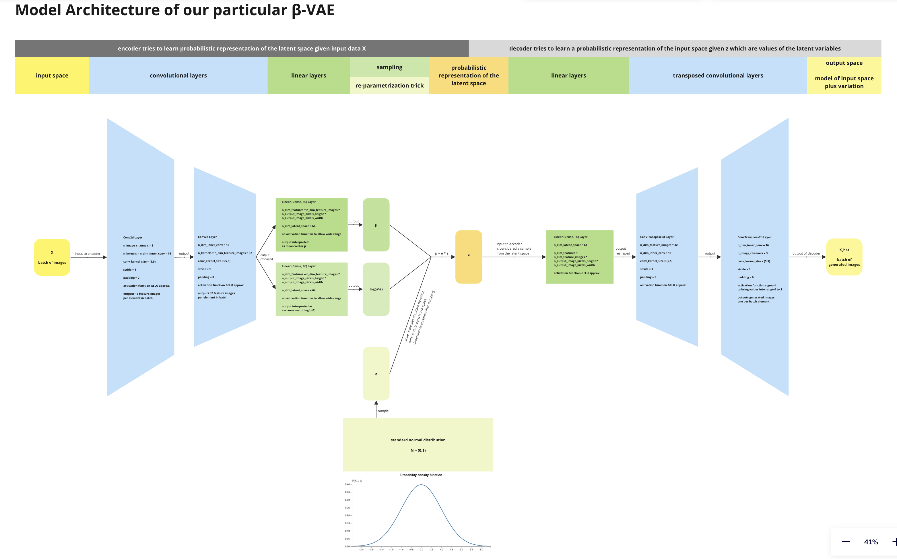
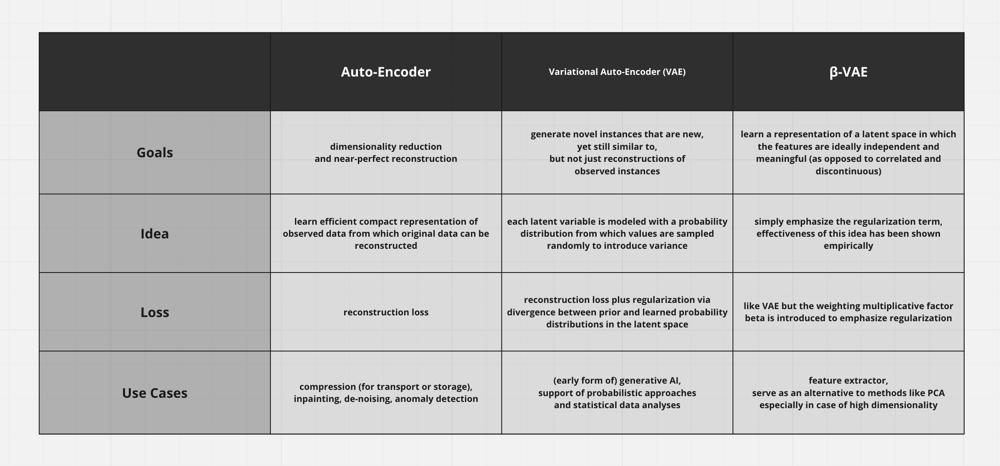
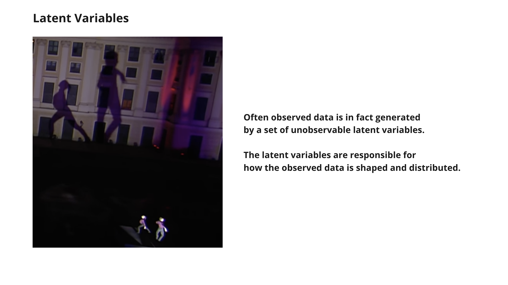
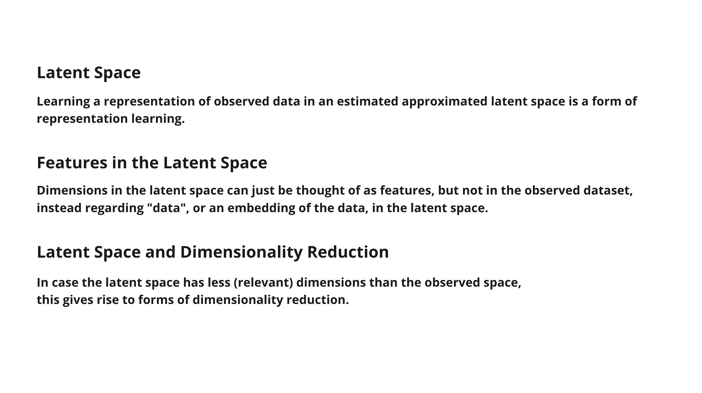
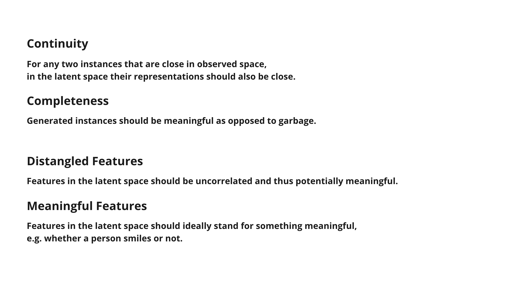
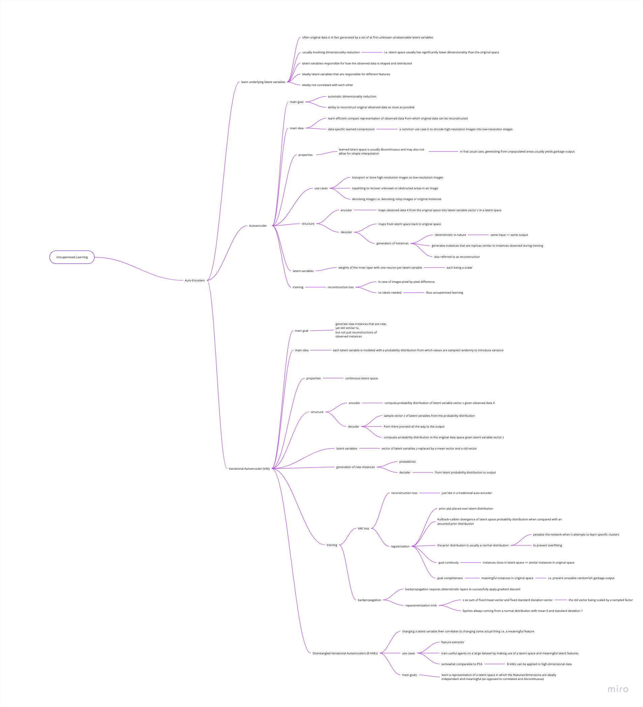

# β-VAE on Oxford Flower Image Dataset

A project for studying purposes.

## Model Architecture



## Comparison



## Slides







## Running the Jupyter notebook on Google Colaboratory

The easiest way to run the Jupyter notebook is
to use [Google Colaboratory](https://colab.research.google.com) aka. Colab.
To open it in Colab, there are basically two options:

1. If the author has shared a link to the notebook on a Google drive with you, open the notebook
from there in Google Colaboratory.

1. Otherwise, simply open the [GitHub URL of the notebook](https://github.com/aisven/beta-vae-oxford-flowers/blob/main/notebooks/beta-vae-oxford-flowers.ipynb)
from within Google Colaboratory via the menu entry *File > Open notebook*, tab *GitHub*.

Then, simply choose *Runtime > Run all* from the menu, however, before doing to, take a moment to
consider running with GPU, as described in the following.

Thanks to PyTorch, the notebook supports running things like model training on a
graphics processing unit (GPU) auto-magically, without further code changes or command line options.
It is just a matter of configuring the Colab runtime, completely outside of the notebook code,
as described in the following. Or alternatively running locally on a machine with GPU,
for that matter, which is covered in a later section.

Running with GPU can be experienced by simply changing the Colab notebook settings via menu entry
*Edit > Notebook settings* where one can for example choose the combination python3, GPU, T4.
If the notebook had already been connected, this simply requires a reconnect, in order to
connect to a Colab runtime with such GPU.

Note that Colab GPUs can be used for free to a comfortable extend. However, eventually Colab is
going to temporarily limit GPU usage per user unless subscribed.
For this project, conveniently, no subscription is needed to get the experience.
The notebook can be executed at least about 10 times until a limitation would kick in for the
first time.

Note that in one of the first code blocks the notebook triggers PyTorch to open the dataset,
which is one of the datasets integrated into PyTorch directly.
If not already done so on the particular Colab runtime, this will also trigger an automatic download
of the dataset to the runtime. Thus, conveniently, there is no need to point the notebook to some
URL or folder in order for it to open the dataset and the contained image files. Also, the download
happens at most once per Colab runtime connection.

## Running the Jupyter notebook locally instead

Alternatively to running it on Google Colaboratory, the notebook can be ran locally.

This project is developed using python (python) and the IDE Visual Studio Code (VS Code).

A common approach is used to setup a local python environment. Given that python 3.9 or higher is
installed on the machine and can be called with the command `python`, the environment can be created
under Linux or macOS using the script `setup.sh` in the root folder of this project. For example,
the following commands could be called in a terminal to setup the python environment:

```
python --version
chmod u+x setup.sh
. ./setup.sh
```

In case python 3.9 or higher is locally called using the command `python3` or `python3.9` etc.,
the command `python` may need to be replaced by the respective command.

Under Windows, the PowerShell script `setup.ps1` is used accordingly.

Once the local python environment has been setup, the Jupyter notebook can be opened and ran
from within Visual Studio Code, given that the Jupyter notebook plugins have been installed
in the IDE. The official documentation about [Jupyter Notebooks in VS Code](https://code.visualstudio.com/docs/datascience/jupyter-notebooks)
can be consulted.

Note that in one of the first code blocks the notebook triggers PyTorch to open the dataset,
which is one of the datasets integrated into PyTorch directly. If not already done so,
this will also trigger an automatic download of the dataset to the local machine.

## Disclaimer regarding the code

The code has been written in a relatively verbose free style for studying purposes.
It is not production-ready and it is not to be regarded as research-related or blog-article code.
Inline comments have been written to verbosely describe aspects that came up during coding.
Assertions have been added to confirm certain conditions along the way.

The author is aware that production-ready code on the other hand would usually, for example,
follow principles of clean code, with automated formatting, linting, spell-checking, etc.,
contain python type-hints in a much more consistent manner,
be automatically tested via test cases written with pytest or similar libraries,
be modularized and packaged properly, with selected functions moved to 1st-party libraries,
allow for proper packaging, export, import, etc. of readily trained models,
be compatible with open source or proprietary machine learning pipelines (think MLOps, DevOps),
be integrated with respective tooling to visualize metrics about model performance,
ship together with benchmarks, examples, cook book or user guide, etc.,
be optimized to some extend.

# Mindmap


