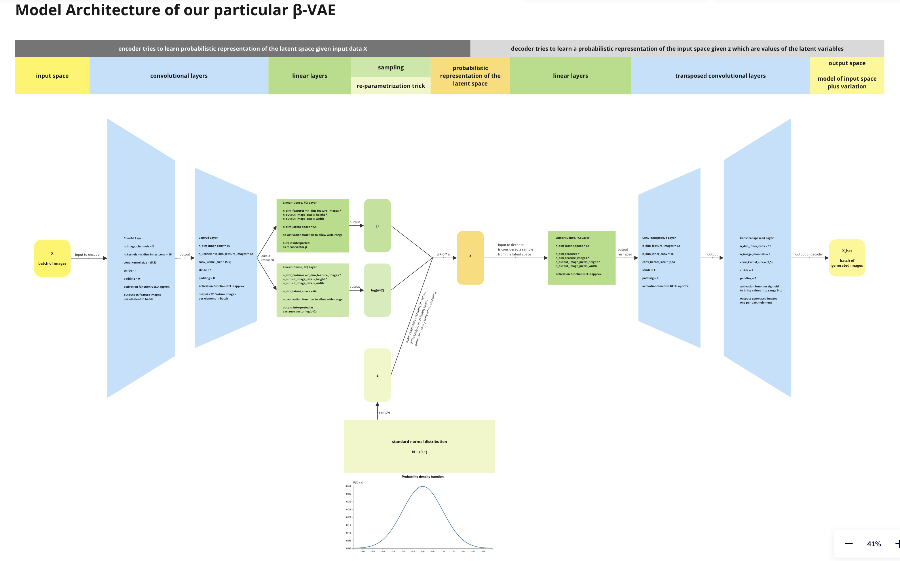
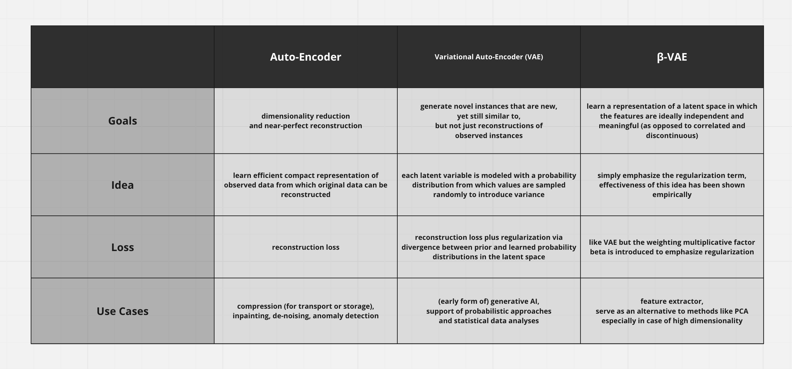
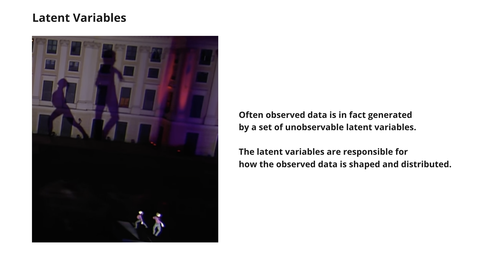
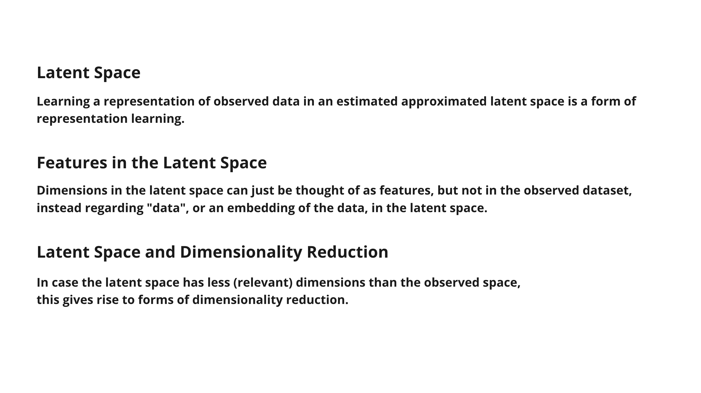
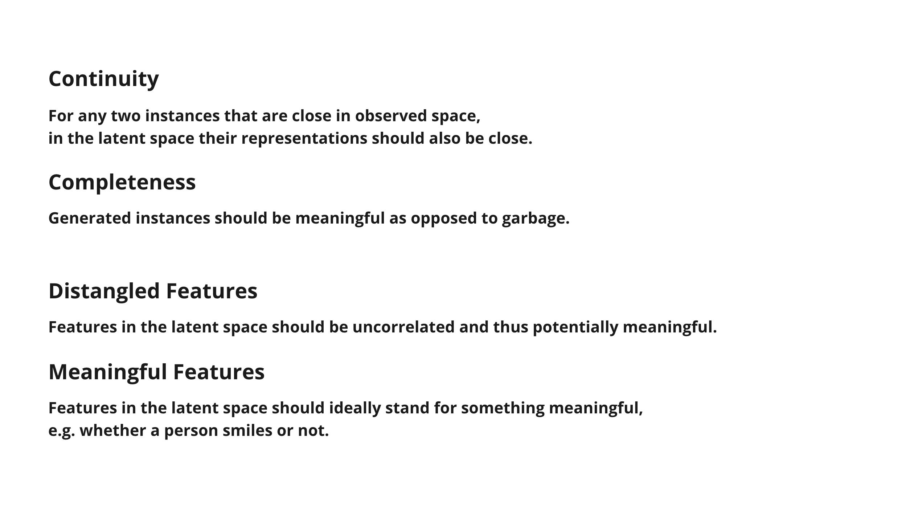
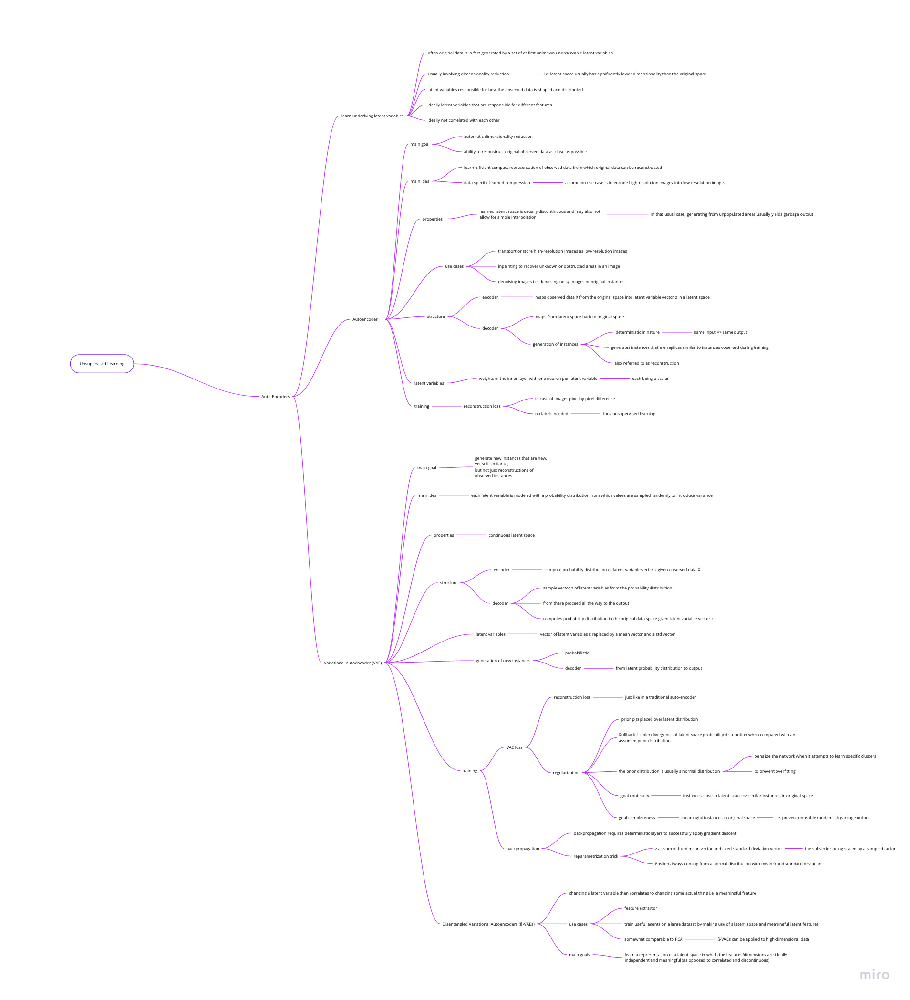

# β-VAE on Oxford Flower Image Dataset

A project for studying purposes.

## Model Architecture



## Development and Build

### Lint code with ruff

```
./lint-code.sh
```

### Format code with black

```
./format-code.sh
```

### Install dependencies with pip

To install project dependencies locally including tools for development and test:

```
./install.sh
```

To install project dependencies locally including tools for development and test
and all the libraries for Jupyter notebook:

```
./install_with_notebook.sh
```

## Running the Jupyter notebook on Google Colab

Note: You might need to out-comment the custom transformation `CustomImageTransform`
in the preprocessing pipeline.

The easiest way to run the Jupyter notebook is
to use [Google Colaboratory](https://colab.research.google.com) aka. Colab.
To open it in Colab, there are basically two options:

1. If the author has shared a link to the notebook on a Google drive with you, open the notebook
from there in Google Colaboratory.

1. Otherwise, simply open the [GitHub URL of the notebook](https://github.com/aisven/beta-vae-oxford-flowers/blob/main/notebooks/beta-vae-oxford-flowers.ipynb)
from within Google Colaboratory via the menu entry *File > Open notebook*, tab *GitHub*.

Then, simply choose *Runtime > Run all* from the menu, however, before doing to, take a moment to
consider running with GPU, as described in the following.

Thanks to PyTorch, the notebook supports running things like model training on a
graphics processing unit (GPU) auto-magically, without further code changes or command line options.
It is just a matter of configuring the Colab runtime, completely outside of the notebook code,
as described in the following. Or alternatively running locally on a machine with GPU,
for that matter, which is covered in a later section.

Running with GPU can be experienced by simply changing the Colab notebook settings via menu entry
*Edit > Notebook settings* where one can for example choose the combination python3, GPU, T4.
If the notebook had already been connected, this simply requires a reconnect, in order to
connect to a Colab runtime with such GPU.

Eventually Colab is going to temporarily limit GPU usage per user unless subscribed.
For this project, conveniently, no subscription is needed to get the experience.
The notebook can be executed at least about 10 times until the limitation kicks in.

Note that in one of the first code blocks the notebook triggers PyTorch to open the dataset,
which is one of the datasets integrated into PyTorch directly.
If not already done so on the particular Colab runtime, this will also trigger an automatic download
of the dataset to the runtime. Thus, conveniently, there is no need to point the notebook to some
URL or folder in order for it to open the dataset and the contained image files. Also, the download
happens at most once per Colab runtime connection.

## Comparison



## Slides







# Mindmap


